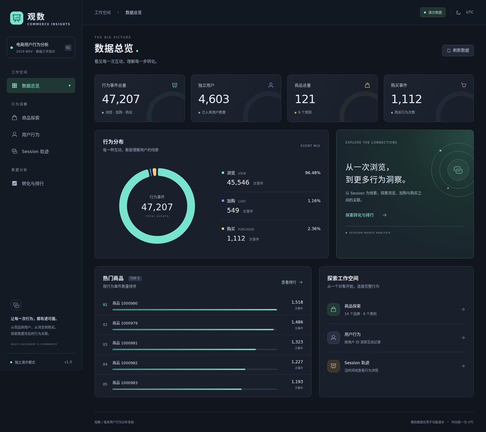
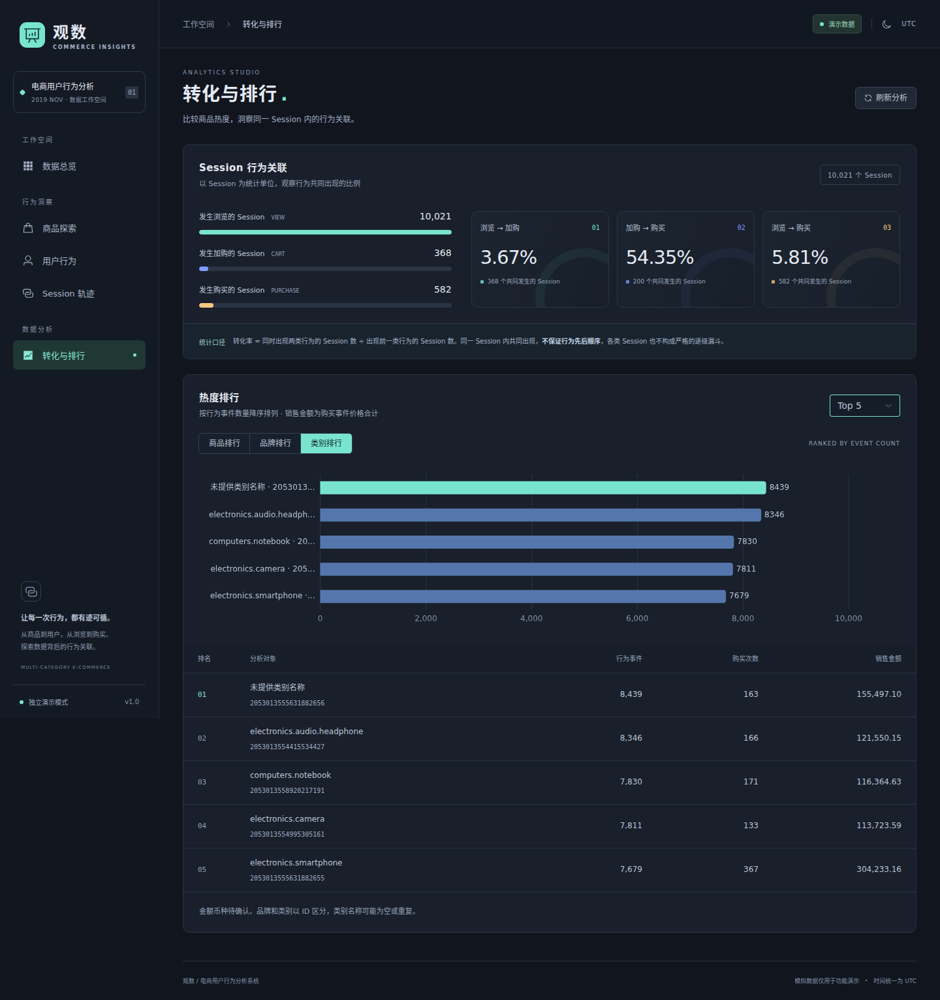

# 前端交接与验收记录

## 交付范围

观数前端覆盖数据总览、商品目录／详情、用户行为、Session 时间线、转化与排行。界面为中文深色分析后台，支持桌面和窄屏。开发、演示构建可脱离后端独立运行；正式构建预留真实接口接入。

本次不修改后端逻辑、数据库、ETL 或原有 Python 测试，不执行全量部署。项目原有“37 passed”和约 600 万事件是后端历史交接记录，本次未复测、未查询真实数据库。

## 快速交接流程

1. 获取个人 Fork 的 `feat/frontend-dashboard` 分支，进入 `frontend/`。
2. 使用 Node.js 22.12+（22 系列）或 24.x，执行 `npm ci`、`npm run dev`。
3. 先查看数据总览，再打开商品目录与商品 `1000978`，检查完整类别 ID 和多品牌展示。
4. 打开演示用户 `564068124`，切换购买筛选，再通过记录进入 Session 与商品详情。
5. 查看转化与排行，切换商品／品牌／类别维度及 Top N；注意 Session 关联口径说明。
6. 需要独立预览构建时运行 `npm run build:demo`、`npm run preview`。
7. 接口负责人提供后端地址后，按 [前端 README](../frontend/README.md) 切换 `npm run dev:api`，真实部署前使用 `npm run build`。

固定演示 ID 沿用 [演示基线](demo_data.md)。合成数据按真实库分布构造：事件类型 view 96.5% / cart 1.2% / purchase 2.4%，Session 漏斗 view→cart 3.67% / cart→purchase 54.3% / view→purchase 5.81%（真实口径 3.68% / 54.2% / 5.82%），时间全月分布、价格 0~2574 长尾。固定演示对象对齐真实记录，两种模式切换页面数字一致：商品 1000978 = 22 条 view，用户 564068124 = 781 条事件（265 购买），Session 4488e77a = 504 条 view。除演示对象外的背景数据仍为合成抽样，总量约 4.7 万条事件，不代表数据库规模。

## 验证范围

| 检查 | 覆盖内容 |
|---|---|
| `npm ci` | 使用锁文件重现依赖安装 |
| `npm run check` | TypeScript、ESLint、Prettier、Vitest：ID 无损解析、接口分页／筛选／错误契约、统计一致性、超时、查询竞态 |
| `npm run test:e2e` | Chromium：六类页面、分页返回、筛选恢复、跨页面链路、零值／空态／错误重试、窄屏与 404、真实模式的拦截响应验证 |
| `npm run build` | 真实接口构建 |
| `npm run build:demo` | 独立 Mock 演示构建 |
| 构建预览 | 本地静态构建可访问，Mock 模式就绪、子路由刷新正常 |
| `git diff --check` | 提交前补丁格式检查 |

本次实际执行结果：依赖锁文件安装、类型检查、ESLint、Prettier、**8 个 Vitest 用例及 6 个 Chromium 流程全部通过**；正式与演示构建均成功，无体积分包警告。两种构建均经过真实浏览器本地预览，验证完整类别 ID、模式标识、子路由刷新及无页面异常；演示构建另外验证图表与时间线页面，正式构建确认未包含 Mock 业务包。

测试环境：Node.js 22.23.2、npm 10.9.8、Chromium 153（Playwright 下载版本）。本机缺少的 NSS／NSPR／ALSA 运行库与中文字体仅在 `/tmp` 临时解压供本次验证使用，未改系统配置，也未将这些环境文件加入仓库。接收方运行浏览器测试时需具备 Chromium 对应的系统运行库。

本次没有执行后端的 37 个测试、真实数据库查询、真实前后端联调、系统部署或生产性能验证。

## 界面预览

截图由真实浏览器打开 Mock 前端生成，不是设计稿；可由浏览器测试重新生成。

窄屏效果见 [移动端长图](screenshots/frontend-mobile.png)。

## 与负责人确认的事项

| 事项 | 当前前端行为 | 集成时需要确认 |
|---|---|---|
| API 地址与跨域 | 开发同源 `/api` 代理；正式版本可配置 API 基址 | 后端地址、生产反向代理或 CORS |
| 大整数 ID | 从原始响应无损解析，所有 ID 在前端使用字符串 | 后端今后是否统一将 ID 输出为字符串 |
| 时间 | 按现有文档的 UTC 约定展示 | 真实响应的时区约定是否一致 |
| 金额 | 两位小数，不添加货币符号 | 原始数据的币种与展示名称 |
| 聚合性能 | 页面独立加载、30 秒超时、手动重试 | 真实数据下总览／排行／转化接口耗时 |
| Session 数据量 | 后端返回完整事件，前端每页渲染 50 条 | 特大 Session 是否需要后端分页 |
| 演示对象 | Mock 使用固定 ID | 真实数据库是否保留这些对象 |

转化接口统计两类行为在 Session 内共同出现，未验证顺序，前端不画严格逐级漏斗。Session 内可能关联多个用户，商品可能关联多个品牌；请在集成时保留这些含义。

由用户自行与负责人对接。本次交付止于个人 Fork 的前端分支，不自动创建 PR、合并原仓库或发送消息。

## 集成确认（2026-09-07，后端负责人回填）

分支已合并至 `main`。联调环境：Docker MySQL（约 600 万真实事件）+ `uvicorn 127.0.0.1:8000`。9 类接口实测通过，响应字段与前端 `types.ts` 逐字段一致；后端 37 个测试全部通过。

| 事项 | 结论 |
|---|---|
| API 地址与跨域 | 后端 `http://127.0.0.1:8000`；`main.py` 已加 CORSMiddleware（GET-only，allow_origins `*`），预检实测通过。dev:api 走 Vite 代理不受影响，正式构建直接配 `VITE_API_BASE_URL` |
| 大整数 ID | 后端保持数值输出（`category_id` 超 JS 安全整数，如 `2053013555631882655`），前端 json-bigint + 字符串化处理正确，后端不改字符串 |
| 时间 | 库内存储 UTC，响应无时区后缀，前端 `utc()` 原样展示，约定一致 |
| 金额 | 数据集无币种字段，维持两位小数无符号 |
| 聚合性能 | 新增索引 `idx_events_session_type (session_id, event_type)`，实测 conversion 37.4s → 3.6s、Session 详情 1.7s → 0.02s、overview 2.4s、top-products 3.2s，均在前端 30 秒超时内 |
| Session 数据量 | 演示 Session 504 条事件 20ms 内返回，暂不做后端分页 |
| 演示对象 | 真实数据库保留全部固定演示 ID（user 564068124 / product 1000978 / session 4488e77a…），Mock 切真实接口后页面数据不变 |

本次集成同步的仓库改动：`backend/app/main.py`（CORS）、`sql/01_schema.sql`（索引定义同步）、README 与 PROJECT_HANDOVER 的后端启动命令修正（需从项目根目录以 `uvicorn backend.app.main:app` 启动，`backend/` 目录下启动会因 `backend.app` 导入路径报错）。
